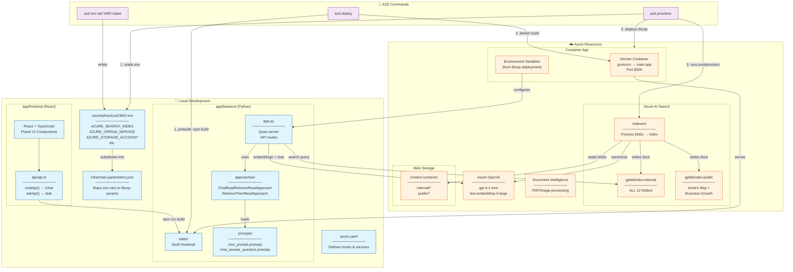

```mermaid
flowchart TB
    subgraph LOCAL["📁 Local Development"]
        ENV[".azure/pheydrusCMO/.env<br/>─────────────<br/>AZURE_SEARCH_INDEX<br/>AZURE_OPENAI_SERVICE<br/>AZURE_STORAGE_ACCOUNT<br/>etc."]
        PARAMS["infra/main.parameters.json<br/>─────────────<br/>Maps env vars to Bicep params"]
        AZUREYAML["azure.yaml<br/>─────────────<br/>Defines hooks & services"]
        
        subgraph FRONTEND["app/frontend (React)"]
            REACT["React + TypeScript<br/>Fluent UI Components"]
            APITS["api/api.ts<br/>─────────────<br/>chatApi() → /chat<br/>askApi() → /ask"]
        end
        
        subgraph BACKEND["app/backend (Python)"]
            STATIC["static/<br/>(built frontend)"]
            APPPY["app.py<br/>─────────────<br/>Quart server<br/>API routes"]
            APPROACHES["approaches/<br/>─────────────<br/>ChatReadRetrieveReadApproach<br/>RetrieveThenReadApproach"]
            PROMPTS["prompts/<br/>─────────────<br/>cmo_prompt.prompty<br/>chat_answer_question.prompty"]
        end
    end
    
    subgraph AZDCOMMANDS["🔧 AZD Commands"]
        ENVSET["azd env set VAR=value"]
        PROVISION["azd provision"]
        DEPLOY["azd deploy"]
    end
    
    subgraph AZURE["☁️ Azure Resources"]
        subgraph CONTAINERAPP["Container App"]
            DOCKER["Docker Container<br/>gunicorn → main:app<br/>Port 8000"]
            ENVVARS["Environment Variables<br/>(from Bicep deployment)"]
        end
        
        subgraph AISEARCH["Azure AI Search"]
            INTERNAL["gptkbindex-internal<br/>─────────────<br/>ALL 12 folders"]
            PUBLIC["gptkbindex-public<br/>─────────────<br/>Artist's Way +<br/>Business Growth"]
            INDEXER["Indexers<br/>─────────────<br/>Process blobs → index"]
        end
        
        subgraph STORAGE["Blob Storage"]
            CONTAINER["content container<br/>─────────────<br/>internal/*<br/>public/*"]
        end
        
        OPENAI["Azure OpenAI<br/>─────────────<br/>gpt-4.1-mini<br/>text-embedding-3-large"]
        
        DOCINT["Document Intelligence<br/>─────────────<br/>PDF/Image processing"]
    end
    
    %% Local flows
    REACT --> APITS
    APITS -->|"npm run build"| STATIC
    
    %% AZD command flows
    ENVSET -->|"writes"| ENV
    ENV -->|"substitutes into"| PARAMS
    PROVISION -->|"1. reads env"| ENV
    PROVISION -->|"2. deploys Bicep"| CONTAINERAPP
    PROVISION -->|"3. runs postprovision"| INDEXER
    DEPLOY -->|"1. prebuild: npm build"| STATIC
    DEPLOY -->|"2. docker build"| DOCKER
    
    %% Runtime flows
    DOCKER -->|"serves"| STATIC
    APPPY -->|"uses"| APPROACHES
    APPROACHES -->|"loads"| PROMPTS
    
    %% Azure service connections
    ENVVARS -->|"configures"| APPPY
    APPPY -->|"search query"| INTERNAL
    APPPY -->|"embeddings + chat"| OPENAI
    INDEXER -->|"reads blobs"| CONTAINER
    INDEXER -->|"vectorizes"| OPENAI
    INDEXER -->|"writes docs"| INTERNAL
    INDEXER -->|"writes docs"| PUBLIC
    
    %% Styling
    classDef local fill:#e1f5fe,stroke:#01579b
    classDef azure fill:#fff3e0,stroke:#e65100
    classDef command fill:#f3e5f5,stroke:#7b1fa2
    
    class ENV,PARAMS,AZUREYAML,REACT,APITS,STATIC,APPPY,APPROACHES,PROMPTS local
    class DOCKER,ENVVARS,INTERNAL,PUBLIC,INDEXER,CONTAINER,OPENAI,DOCINT azure
    class ENVSET,PROVISION,DEPLOY command
```